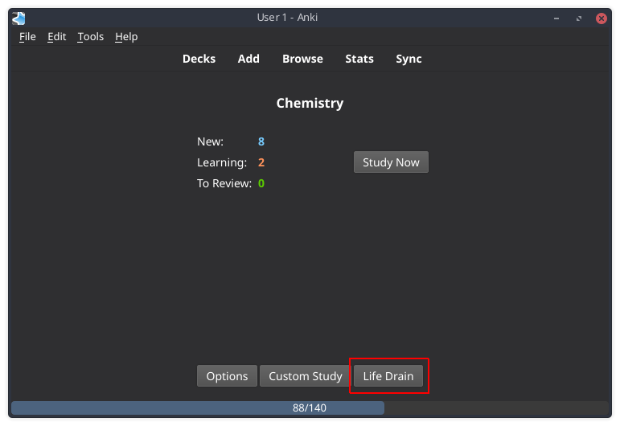

# anki-lifedrain 
This add-on adds a life bar during your reviews.
Your life reduces within time, and you must answer the questions in order to recover it.

## Objective
The objective is to give a visual feedback of how fast the questions are being answered.
If the life is low, it means that you are distracted or taking too much time to answer.

## Install
### Recommended way
- Install from the [AnkiWeb](https://ankiweb.net/shared/info/715575551).

### Manual
- Anki 2.1: Copy the folder `lifedrain` into your add-ons folder.

## Screenshot

## Features
### Global settings
There are many configurations to style the bar.
Access `Tools > Preferences`, then select the tab `Life Drain`, and you'll see this screen:

- **Enable Life Drain**: Enable/disable the add-on without restarting Anki.
- **Stop drain on answer shown**: Automatically stops the drain after answering a card.
- **Position**: Choose where to show the bar: `Top` or `Bottom`.
- **Height**: The height of the bar, to make it bigger or smaller.
- **Border radius**: Adds a rounded border to the bar.
- **Text**: The text shown inside the bar.
- **Style**: Allow selecting some custom style to the bar (not all options may work on your platform).
- **Bar color**: The color of the bar.
- **Text color**: If you chose to show text, you can select its color.

### Deck settings
You can create different configurations for each deck.
Here you may set things like your maximum life and the recover value when answering a card!

On the overview screen,
click the Life Drain button (or press its shortcut **L**).

Then the following dialog will appear:

- **Maximum life**: The time in seconds for the life bar go from full to empty.
- **Recover**: The time in seconds that is recovered after answering a card.
- **Enable damage**: Enable damage if a card is answered with 'Again'.
- **Damage**: The damage value to be dealt if answering with 'Again'.
- **Current life**: The current life, in seconds.

### Pause drain during reviews
If for some reason you want to stop the drain, press **P** (**P**ause) to toggle it!

## Integration with other add-ons
This add-on have some hooks that can be used by other add-ons.

Whenever the life drops to 0, the hook `LifeDrain.gameOver` is triggered.
You may use it in your add-on to make something interesting happen.

And there is a method you can call using hook to recover (or drain) the user's life.
It has 3 optional parameters:
1st is `increment` (boolean), True to recover (default) and False to drain.
2nd is `value` (integer). Default is the recover value set by the user in the deck preferences.
3rd is `damage` (boolean). If set to true and no `value` is supplied, the damage value set by the user in the deck preferences is subtracted. The value of `increment` is ignored when this parameter is in use.

Examples:

- `runHook('LifeDrain.recover')` recovers the life using the default value in deck preferences
- `runHook('LifeDrain.recover', False)` drains the life using the default value in deck preferences
- `runHook('LifeDrain.recover', True, 9999)` recovers all the life
- `runHook('LifeDrain.recover', True, None, True)` drains the life using the damage value in deck preferences

## Inspiration
This add-on was inspired on the add-on [Progress Bar](https://ankiweb.net/shared/info/2091361802) and the game [osu!](https://osu.ppy.sh/).

The [Progress Bar](https://ankiweb.net/shared/info/2091361802) add-on showed me that it was possible to add a bar to the review screen, and provide visual feedback through it.

[Osu!](https://osu.ppy.sh/) is a rhythm game I play, and one of its features is a life bar that reduces while playing, and to recover it you have to click the circles in the correct timing.

And then I just thought: why not to have a life bar with drain in Anki?

## Feedback & Contribution
If you find any bugs, feel free to open issues. I'll try to answer / fix those as soon as I can!

If you want to help even more, fell free to open a PR too!

Any feedback and help is very welcome!

## Donations
A lot of time have been used to create and maintain this add-on.
I did this on my spare time (I also have a job!).
If you like it, any donation will be greatly appreciated!

