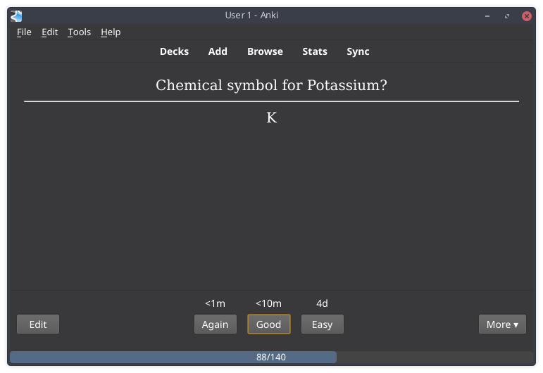

# Life Drain 

An [Anki](https://apps.ankiweb.net/) add-on that adds a life bar to your reviews.

Your life reduces within time, and you must answer the questions in order to recover it.

## Objective

The objective is to give a visual feedback of how fast the questions are being answered.
If the life is low, it means that you are distracted or taking too much time to answer.

## Install
### Recommended

- Install from the [AnkiWeb](https://ankiweb.net/shared/info/715575551).

### Manual

- Copy the folder `src` into your add-ons folder. You need at least Anki 2.1.22 for the latest Life Drain.

## Documentation

[Click here](https://github.com/Yutsuten/anki-lifedrain/wiki) and access the wiki for this add-on!

## Feedback & Contribution

If you find any bugs, feel free to [open an issue](https://github.com/Yutsuten/anki-lifedrain/issues). I'll try to answer / fix those as soon as I can!

If you have experience with coding, feel free to open a Pull Request!

Any feedback and help is very welcome!

## Donations

A lot of time is being used to maintain this add-on.
I'm doing this on my spare time (I have a full-time job!).

If you like this add-on, donation of any value will be greatly appreciated!

To donate, use the "Sponsor" button on the top of this page.
