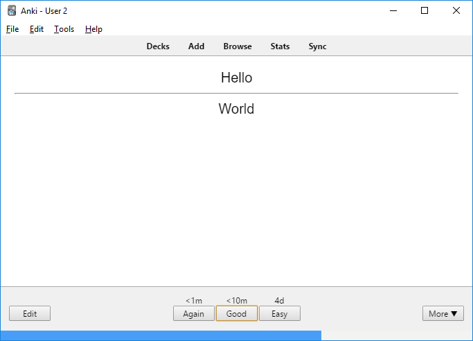
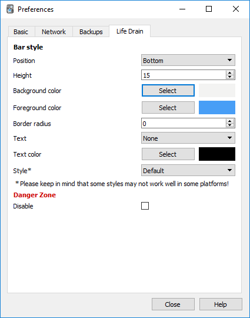
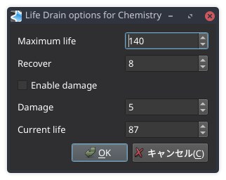
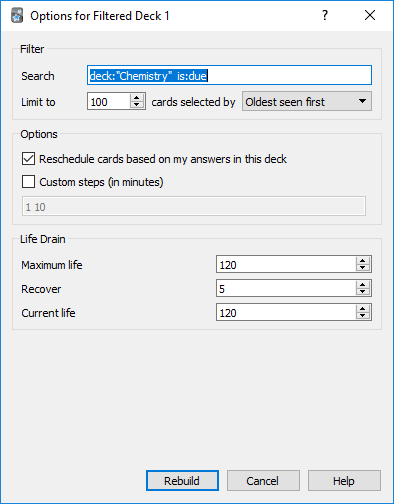

# anki-lifedrain 
This add-on adds a life bar during your reviews.
Your life reduces within time, and you must answer the questions in order to recover it.

## Objective
The objective is to give a visual feedback of how fast the questions are being answered.
If the life is low, it means that you are distracted or taking too much time to answer.

## Install
### Recommended way
- Follow the instructions in [AnkiWeb](https://ankiweb.net/shared/info/715575551).

### Manual
Inside the folder `src/`:
- Anki 2.0: Copy the file `__init__.py` and the folder `lifedrain` into your add-ons folder.
- Anki 2.1: Copy the folder `lifedrain` into your add-ons folder.

## Screenshot

## Features
### Bar behaviour/styling
There are many configurations to style the bar.
Access `Tools > Preferences`, then select the tab `Life Drain`, and you'll see this screen:

- **Stop drain on answer shown**: Automatically stops the drain after answering a card.
- **Disable Life Drain**: Disable the add-on if you don't want to rush yourself all the time.
- **Position**: Choose where to show the bar: `Top` or `Bottom`.
- **Height**: The height of the bar, to make it bigger or smaller.
- **Border radius**: Adds a rounded border to the bar.
- **Text**: The text shown inside the bar.
- **Style**: Allow selecting some custom style to the bar.
- **Background color**: The background color of the bar.
- **Foreground color**: The foreground color of the bar.
- **Text color**: If you chose to show text, you can select its color.

### Bar configuration (per deck)
The bar has 3 configurations: the `Maximum life`, `Recover` and `Current life`.

Select a deck, then in `Options`, select the tab `Life Drain`:

Filtered deck configurations (Added in 2018-07-01):

- **Maximum life**: Is the time in seconds for the life bar go from full to empty.
- **Recover**: Is the time in seconds that is recovered after answering a card.
- **Enable damage**: Select this to reduce the time remaining on the life bar each time a card is responded to with 'Again'.
- **Damage**: Is the time in seconds that is removed when a card is responded to with 'Again'.
- **Current life**: Your current life, in case you want to set it for whatever reason.

### Pause drain during reviews
If for some reason you want to stop the drain, press **P** (**P**ause) to toggle it!

## Integration with other add-ons
This add-on have some hooks that can be used by other add-ons.

Whenever the life drops to 0, the hook `LifeDrain.gameOver` is triggered.
You may use it in your add-on to make something interesting happen.

And there is a method you can call using hook to recover (or drain) the user's life.
It has 3 optional parameters:
1st is `increment` (boolean), True to recover (default) and False to drain.
2nd is `value` (integer). Default is the recover value set by the user in the deck preferences.
3rd is `damage` (boolean). If set to true and no `value` is supplied, the damage value set by the user in the deck preferences is subtracted. The value of `increment` is ignored when this parameter is in use.

Examples:

- `runHook('LifeDrain.recover')` recovers the life using the default value in deck preferences
- `runHook('LifeDrain.recover', False)` drains the life using the default value in deck preferences
- `runHook('LifeDrain.recover', True, 9999)` recovers all the life
- `runHook('LifeDrain.recover', True, None, True)` drains the life using the damage value in deck preferences

## Inspiration
This add-on was inspired on the add-on [Progress Bar](https://ankiweb.net/shared/info/2091361802) and the game [osu!](https://osu.ppy.sh/).

The [Progress Bar](https://ankiweb.net/shared/info/2091361802) add-on showed me that it was possible to add a bar to the review screen, and provide visual feedback through it.

[Osu!](https://osu.ppy.sh/) is a rhythm game I play, and one of its features is a life bar that reduces while playing, and to recover it you have to click the circles in the correct timing.

And then I just thought: why not to have a life bar with drain in Anki?

## CHANGELOG
- **2019-07-30**: Fix undo while reviewing not removing life on Anki 2.1 ([PR #36](https://github.com/Yutsuten/anki-lifedrain/pull/36)); Ignore errors from another add-ons being raised in Life Drain. ([PR #38](https://github.com/Yutsuten/anki-lifedrain/pull/38))
- **2019-06-11**: Add damage feature (Thanks to [@whiteisthenewblack](https://github.com/whiteisthenewblack) in [PR #35](https://github.com/Yutsuten/anki-lifedrain/pull/35)).
- **2019-04-28**: Fix bug when selecting bar colors on Mac OS. ([Issue #30](https://github.com/Yutsuten/anki-lifedrain/issues/30))
- **2019-01-12**: Added option to stop drain on answer shown.
- **2018-12-09**: Added disable option and some hooks to allow integration with other add-ons.
- **2018-12-08**: Fixed autosync failing.
- **2018-12-01**: Fixed sync failing.
- **2018-12-01**: Make the settings more flexible (max life with 4 digits and drain 0) and bugfix.
- **2018-11-23**: Added option to show remaining life as text.
- **2018-10-27**: Fixed keyboard shortcut affecting other add-ons on Anki 2.1.
- **2018-07-01**: Added life drain options to filtered decks.
- **2018-06-10**: Fixed bugs when suspending cards while reviewing.
- **2018-05-20**: Initial release.

## Contribute
If you find any bugs, feel free to open issues. I'll try to answer / fix those as soon as I can!

If you want to help even more, fell free to open a PR too!

Any feedback and help is very welcome!
